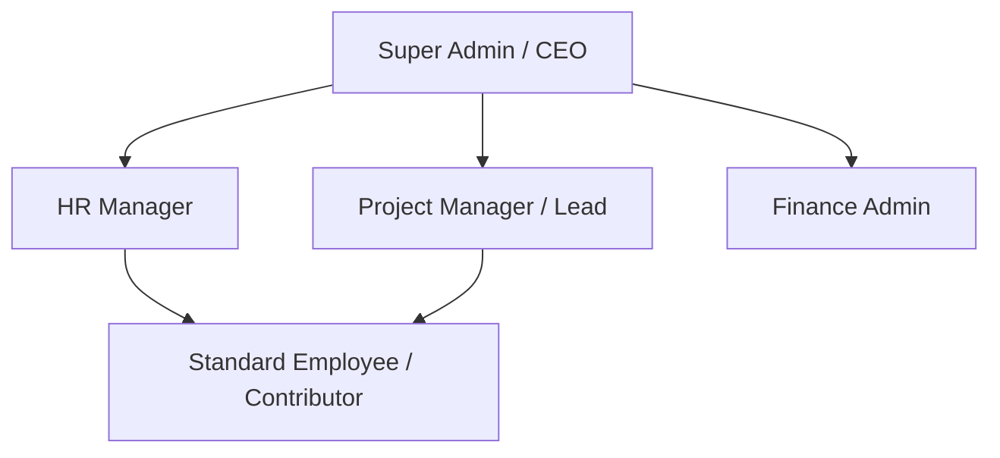
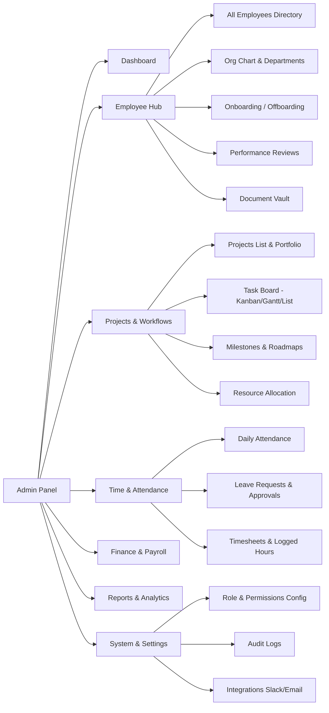
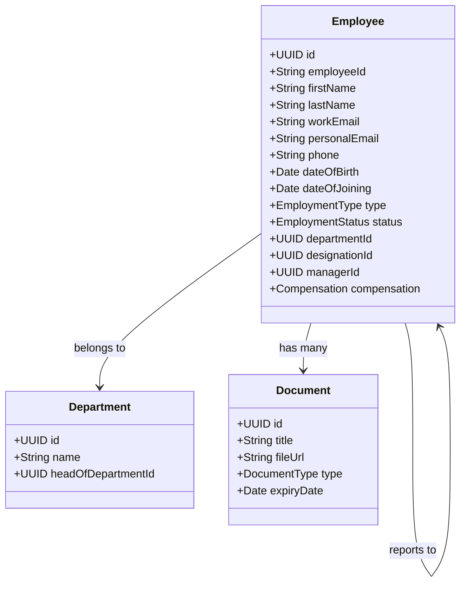
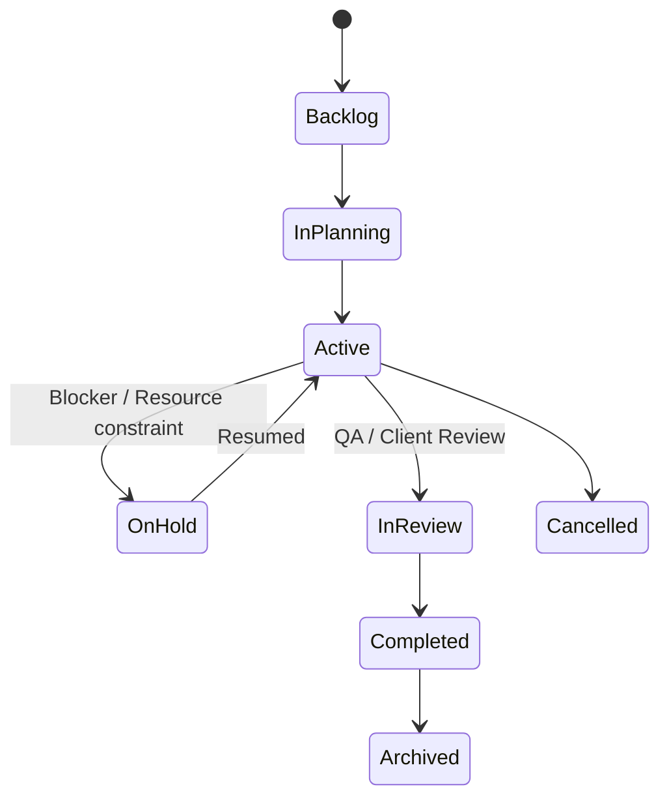
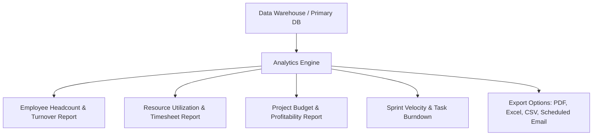
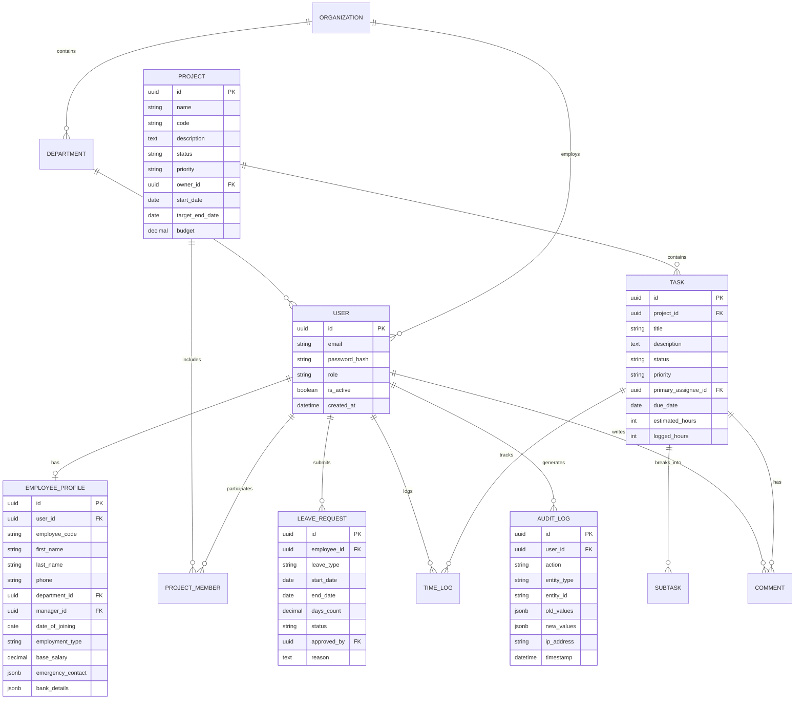

# Product Requirement Document (PRD)
## Enterprise Company Admin Panel & Workforce/Project Management System

---

| **Document Version** | 1.0.0 |
| **Status** | Approved for Development |
| **Target Launch** | Q3 / Q4 |
| **Authors / Owners** | Product & Engineering Team |
| **Stakeholders** | Executives, HR Operations, Project Managers, Engineering Leads |

---

## 1. Executive Summary & Product Vision

### 1.1 Problem Statement
Modern growing companies struggle with fragmented operational tooling: employee data is trapped in spreadsheets or standalone HR systems, while daily task and project tracking lives across disparate project management tools. This disconnect causes:
- Lack of single-source-of-truth for employee allocation and project bandwidth.
- Time-consuming manual tracking of attendance, leaves, deliverables, and performance.
- Weak access control and lack of unified audit logs across organizational assets.
- Inefficient executive oversight on project health vs. human resource cost.

### 1.2 Product Vision
Build a unified, robust, and modern **Company Enterprise Admin Panel** that serves as the single operational operating system for the entire company. It seamlessly bridges **Human Resource Management (HRM)** with **Project & Task Management (PPM)** under a centralized, secure, role-based architecture.

### 1.3 Key Value Propositions
1. **360° Employee Profiling**: Complete visibility into employee identity, department hierarchy, compensation overview, attendance, leaves, and assigned assets.
2. **End-to-End Project & Task Lifecycle**: Manage projects from inception to delivery with Kanban, Gantt, and List views, task dependencies, time tracking, and milestone health.
3. **Cross-Domain Resource Allocation**: Real-time correlation between employee workloads, availability, and active project assignments to prevent burnout and project delays.
4. **Enterprise-Grade Security & Governance**: Granular Role-Based Access Control (RBAC), multi-factor authentication (MFA), and audit logging.
5. **Actionable Executive Analytics**: Real-time dashboards visualizing company headcount growth, project burndown, team velocity, and organizational productivity.

---

## 2. User Personas & Permissions Matrix



### 2.1 User Personas

| Persona | Key Responsibilities | Primary Needs & Pain Points |
| :--- | :--- | :--- |
| **Super Admin / C-Suite** | Organizational strategy, executive oversight, global settings, compliance | Needs high-level executive dashboards, company health metrics, security audits, and full system control. |
| **HR Manager** | Employee onboarding/offboarding, leave policies, payroll overview, performance reviews | Needs an intuitive directory, leave approval flows, attendance records, document storage, and org-chart visualization. |
| **Project Manager / Lead** | Project planning, sprint management, task delegation, milestone delivery | Needs Kanban/Gantt views, workload distribution charts, blocker tracking, and time logging verification. |
| **Employee / Contributor** | Daily task execution, time logging, leave applications, personal profile management | Needs clean "My Tasks" view, quick clock-in/out or time logs, self-service leave requests, and company announcements. |
| **Finance / Operations** | Budget oversight, expense tracking, payroll processing review | Needs compensation summaries, billable hours reports, and contractor invoice tracking. |

### 2.2 Role-Based Access Control (RBAC) Matrix

| Feature / Module | Super Admin | HR Manager | Project Manager | Employee / Contributor | Finance Admin |
| :--- | :---: | :---: | :---: | :---: | :---: |
| **Executive Analytics Dashboard** | Full | HR Only | Project Only | Self Only | Financial / HR |
| **Employee Directory (View All)** | Full | Full | Read-Only | Read-Only (Public fields) | Read-Only |
| **Employee Management (Create/Edit/Delete)**| Full | Full | None | Self (Limited) | None |
| **Salary / Compensation Data** | Full | Full | None | Self Only | Full |
| **Leave & Attendance Approvals** | Full | Full | Team Only | Self Request | Read-Only |
| **Project Management (Create/Archive)** | Full | None | Full | View Assigned | Read-Only |
| **Task Management (Create/Assign/Edit)** | Full | None | Full | Assigned Only | None |
| **Time Tracking / Log Approval** | Full | None | Team Only | Self Log | Read-Only |
| **System Settings & Audit Logs** | Full | None | None | None | None |

---

## 3. Information Architecture & Sitemap



---

## 4. Detailed Functional Requirements & Specifications

### 4.1 Module 1: Authentication, Security & RBAC
- **Multi-tenant / Single Organization Auth**: Email/Password + SSO (Google Workspace, Microsoft Azure AD / Okta).
- **Two-Factor Authentication (2FA)**: Mandatory enforcement for Admin/HR/Finance roles (TOTP via Authenticator Apps or SMS fallback).
- **Session & Password Policies**: Configurable session timeouts, IP allowlisting for sensitive roles, minimum password entropy.
- **Granular Permissions Engine**: Capabilities defined at the action level (e.g., `employee.salary.read`, `task.delete`, `project.budget.edit`).

---

### 4.2 Module 2: Centralized Dashboard
- **Executive KPI Cards**:
  - Total Active Employees (with MoM headcount growth).
  - Active Projects vs. Completed Projects vs. At-Risk Projects.
  - Overall Task Completion Rate & Open Critical Blockers.
  - Company Attendance Rate & On-Leave Personnel today.
- **Interactive Widgets**:
  - **Quick Action Bar**: "Add Employee", "Create Project", "New Task", "Request Leave", "Broadcast Announcement".
  - **Project Health Matrix**: Progress bar and deadline countdowns for high-priority projects.
  - **Workload / Resource Gauge**: Over-allocated team members requiring attention.
  - **Live Company Feed**: Recent promotions, new hires, milestone achievements, and system audit logs.

---

### 4.3 Module 3: Employee Management System (EMS)



#### 4.3.1 Detailed Employee Profile
1. **Personal Information**: Full name, avatar, contact details, date of birth, emergency contacts, residential address, government IDs (e.g., SSN/National ID/Tax ID).
2. **Work & Position Details**: Unique Employee ID (e.g., `EMP-1042`), official email, department, designation/job title, reporting manager (hierarchy link), employment type (Full-time, Part-time, Contractor, Intern), work location (Remote, Hybrid, On-site, Office branch).
3. **Compensation & Banking (Restricted Access)**: Base salary, hourly rates, pay frequency, bank account details, tax bracket info.
4. **Assigned Company Assets**: Hardware (laptops, monitors, serial numbers), software license assignments, keycard IDs.
5. **Document Repository**: Offer letters, contracts, NDAs, identification documents, performance review PDFs with upload/download restrictions.

#### 4.3.2 Department & Organizational Hierarchy
- Visual interactive **Org Chart** rendering dynamic reporting lines.
- Department management: Creation, department lead assignment, budget allocation, team headcount quotas.
- Role & designation management with standardized level mapping (e.g., Junior, Mid, Senior, Lead, Director).

#### 4.3.3 Lifecycle Management
- **Onboarding Checklist**: Automated task generation for IT (laptop setup), HR (contracts), and Manager (introductory 1-on-1s).
- **Offboarding Workflow**: Asset return checklist, access revocation trigger, exit interview form, resignation/termination audit log.

---

### 4.4 Module 4: Time, Attendance & Leave Management

#### 4.4.1 Attendance Tracking
- Multiple check-in methods: Web portal click, IP-restricted clock-in, geofencing (optional mobile), or hardware biometric API sync.
- Real-time status badges on employee profiles (Online, In a Meeting, On Leave, Away, Clocked Out).
- Automated timesheet generation summarizing daily hours, overtime, and missing punch alerts.

#### 4.4.2 Leave / Paid Time Off (PTO) Engine
- **Customizable Leave Policies**: Annual Paid Leave, Sick Leave, Casual Leave, Maternity/Paternity, Unpaid Leave.
- **Accrual Rules**: Monthly accrual or annual lump sum with carry-over limits.
- **Approval Hierarchy**: Employee requests -> Direct Manager notified -> Approval/Rejection with notes -> HR informed -> Auto-updates calendar and team dashboard.

---

### 4.5 Module 5: Project & Portfolio Management (PPM)



#### 4.5.1 Project Creation & Metadata
- **Basic Info**: Project Title, Code (e.g., `PRJ-ALPHA`), Client/Internal Stakeholder, Description, Category/Tags.
- **Timeline & Schedule**: Start Date, Target End Date, Actual Completion Date, Critical Milestones.
- **Budgeting & Resources**: Estimated budget vs. actual cost (derived from employee logged hours * hourly billing rate).
- **Team Allocation**: Project Lead, Assigned Contributors, Stakeholder Viewers.
- **Project Health Indicators**: Automated status calculation (`On Track`, `At Risk`, `Delayed`, `On Hold`, `Completed`).

#### 4.5.2 Project Views
- **Table / List View**: Comprehensive spreadsheet-like view with inline filtering by status, lead, priority, and date.
- **Kanban Board**: Drag-and-drop workflow stages (`Backlog`, `To Do`, `In Progress`, `Code Review / QA`, `Done`).
- **Gantt Chart / Roadmap**: Interactive timeline visualization showing project milestones and task dependencies.
- **Resource Workload View**: Heatmap of hours allocated per team member across concurrent projects.

---

### 4.6 Module 6: Task Management & Workflow Automation

#### 4.6.1 Task Structure & Capabilities
- **Task Identity**: Title, Unique ID (e.g., `PRJ-402`), Parent Project, Milestone link.
- **Assignment**: Multiple assignees or primary assignee with secondary collaborators.
- **Prioritization**: `Urgent / Critical` (P0), `High` (P1), `Medium` (P2), `Low` (P3).
- **Detailed Description**: Rich text markdown editor with `@mentions`, code blocks, table support, and embedded screenshots.
- **Subtasks & Checklists**: Nested subtasks with independent assignees, deadlines, and completion checkboxes.
- **Dependencies**: Explicit relational rules (`Blocks`, `Is Blocked By`, `Relates To`).
- **Time Tracking**:
  - Built-in live stopwatch timer.
  - Manual time entry with billable/non-billable flag and description.
- **Comments & Activity Stream**: Timestamped discussions, file attachments, and audit trail of any status/assignee updates.

#### 4.6.2 Automation Triggers & Rules
- *When all subtasks are checked* $\rightarrow$ *Move parent task to "Ready for Review"*.
- *When a task is marked "Urgent"* $\rightarrow$ *Send immediate Slack/Email alert to Project Lead*.
- *When a task exceeds its due date* $\rightarrow$ *Flag task as "Overdue" and increment project risk score*.

---

### 4.7 Module 7: Reports, Analytics & Exports



- **HR Analytics**: Headcount trends, department distribution, leave utilization, absenteeism, employee retention rates.
- **Project & Delivery Analytics**: Sprint velocity, burndown charts, lead time, cycle time, bottleneck analysis.
- **Timesheet & Billing Reports**: Billable vs. non-billable hours breakdown per client/project.
- **Data Export Formats**: Instant download as `.xlsx`, `.csv`, or formatted `.pdf` with company branding; recurring automated email digests for management.

---

### 4.8 Module 8: Notifications, Announcements & Audit Trail

- **Central Notification Center**:
  - In-app notification bell with unread counter.
  - Filterable by: `@mentions`, Task Assignments, Leave Approvals, System Alerts.
- **Broadcast Announcements**: Company-wide banners or targeted department notices with read receipts.
- **Immutable Audit Logging**:
  - Tracks: User ID, Action, Target Entity, Old Value, New Value, IP Address, Timestamp.
  - Essential for compliance (e.g., tracking who viewed salary details or altered task deadlines).

---

## 5. Technical Architecture & Database Design

### 5.1 Recommended Modern Tech Stack

| Layer | Recommended Technology | Rationale |
| :--- | :--- | :--- |
| **Frontend UI** | **Next.js 14+ (App Router) / React + TypeScript + Tailwind CSS** | Server-side rendering for lightning-fast loads, robust component ecosystems (shadcn/ui, TanStack Table, Lucide Icons). |
| **UI Components** | **shadcn/ui + Radix UI + Framer Motion + Recharts** | High accessibility (a11y), clean enterprise aesthetics, responsive interactive charts. |
| **Backend API** | **Node.js (NestJS / Express) or Go / Python (FastAPI)** | High throughput, type-safe API contracts, modular architecture for enterprise scalability. |
| **Database** | **PostgreSQL (with Prisma or Drizzle ORM)** | ACID compliance, relational integrity, powerful JSONB support, full-text search. |
| **Caching & Queues** | **Redis + BullMQ** | Fast session management, background email jobs, automated webhook delivery, real-time counter caching. |
| **Real-time Engine** | **WebSockets / Socket.io / Supabase Realtime** | Instant board updates, live collaborative comments, active presence tracking. |
| **Storage** | **AWS S3 / Cloudflare R2 (with Pre-signed URLs)** | Secure, encrypted file uploads for documents, avatars, and task attachments. |

---

### 5.2 Core Entity-Relationship Diagram (ERD)



---

## 6. Non-Functional Requirements (NFRs)

### 6.1 Performance & Scalability
- **Page Load Time**: First Contentful Paint (FCP) $< 1.2\text{s}$, Time to Interactive (TTI) $< 2.0\text{s}$.
- **API Latency**: P95 response time $< 150\text{ms}$ for standard CRUD endpoints; $< 400\text{ms}$ for complex analytical aggregations.
- **Concurrent Users**: Architecture must support 5,000+ concurrent active enterprise users without performance degradation.
- **Data Pagination & Virtualization**: All tables (Employees, Tasks, Logs) must utilize server-side pagination or client virtualized lists for datasets exceeding 100,000 records.

### 6.2 Security & Compliance
- **Data Encryption**: AES-256 for data at rest (database, S3 storage); TLS 1.3 for data in transit.
- **Access Isolation**: Tenant and departmental data scoping enforced at the ORM/database query layer.
- **PII / Sensitive Data Protection**: Masking of tax IDs, bank accounts, and compensation figures from general system logs and unauthorized API payloads.
- **Compliance Alignment**: Architecture built to adhere to GDPR (Right to Erasure, Data Portability) and SOC2 compliance controls.

### 6.3 Usability & Design Standards
- **Responsive Layout**: Optimized for Desktop (1440px+), Laptop (1024px+), and Tablet/Mobile (responsive drawer navigation for urgent approvals on-the-go).
- **Theme Modes**: Native Light Mode and High-Contrast Dark Mode.
- **Accessibility (a11y)**: Compliance with **WCAG 2.1 Level AA** standards (keyboard navigation, screen reader ARIA tags, color contrast ratios).

---

## 7. Phased Implementation Roadmap

```mermaid
gantt
    title Enterprise Admin Panel Implementation Roadmap
    dateFormat  YYYY-MM-DD
    section Phase 1 - Foundation & MVP
    Auth & RBAC Architecture         :done, 2026-09-01, 14d
    Employee Directory & Profiles     :active, 2026-09-15, 21d
    Basic Project & Kanban Tasks      :2026-10-06, 21d
    section Phase 2 - Advanced HRM & Tracking
    Leave Management & Attendance     :2026-10-27, 21d
    Org Chart & Department Hierarchy  :2026-11-17, 14d
    Document Vault & Asset Tracking   :2026-12-01, 14d
    section Phase 3 - Advanced PM & Workflows
    Gantt Chart & Task Dependencies   :2026-12-15, 21d
    Time Logging & Timesheet Approval :2027-01-05, 14d
    Workflow Automations & Triggers   :2027-01-19, 14d
    section Phase 4 - Enterprise & AI
    Executive Analytics & Reports     :2027-02-02, 21d
    Audit Logs & Security Hardening   :2027-02-23, 14d
    Slack / Microsoft Teams Sync      :2027-03-09, 14d
```

### Phase Breakdown
1. **Phase 1 (MVP - Foundation)**:
   - User authentication, 2FA, and RBAC framework.
   - Core Employee Directory with full CRUD, search, filter, and detailed profile pages.
   - Project creation and Kanban-based task management with assignment and priority tags.
2. **Phase 2 (Workforce Operations & HRM)**:
   - Attendance clock-in/out and multi-tier Leave Request / Approval workflows.
   - Interactive SVG/Canvas Organizational Chart.
   - Document upload/management vault and company hardware asset tracker.
3. **Phase 3 (Advanced Project Management & Time Tracking)**:
   - Interactive Gantt timeline charts and task dependency visualization.
   - Detailed time tracking (live stopwatch + manual logging) with timesheet review.
   - Configurable trigger-action automated workflow rules.
4. **Phase 4 (Enterprise Analytics, Integrations & Compliance)**:
   - Executive BI analytics, custom report builder, and scheduled PDF/Excel exports.
   - Full immutable audit log viewer with search and IP filtering.
   - Third-party webhook integrations (Slack, MS Teams, Google Calendar).

---

## 8. Risks, Assumptions & Mitigation Strategies

| Identified Risk | Impact | Likelihood | Mitigation Strategy |
| :--- | :---: | :---: | :--- |
| **Unauthorized Access to Sensitive Salary Data** | High | Low | Enforce field-level encryption and strict backend middleware authorization checks (`requirePermission('salary.view')`) before serialization. |
| **Complex Task Dependency Deadlocks** | Medium | Medium | Implement cycle detection algorithms (Directed Acyclic Graph validation) when saving task dependencies. |
| **Performance Degradation with Large Org Charts** | Medium | Low | Use lazy-loading branch expansion and virtualized DOM rendering for companies with $> 1,000$ employees. |
| **Adoption Resistance by Employees** | Medium | Medium | Provide a dedicated, frictionless "My Workspace" portal focused strictly on the individual's daily tasks, quick time logs, and leave status. |

---

## 9. Success Metrics & Key Performance Indicators (KPIs)

- **Operational Efficiency**: 60% reduction in time spent by HR approving leaves and managing employee records.
- **Project Delivery Predictability**: 35% improvement in on-time milestone delivery via real-time risk alerts.
- **Adoption Rate**: $> 90\%$ Daily Active Users (DAU) among company staff within 30 days of rollout.
- **System Reliability**: $99.9\%$ platform availability with zero critical security audit findings.
